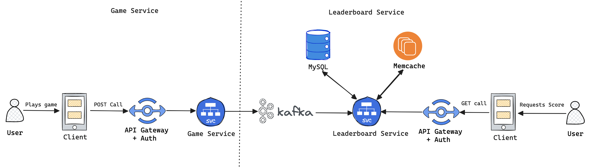
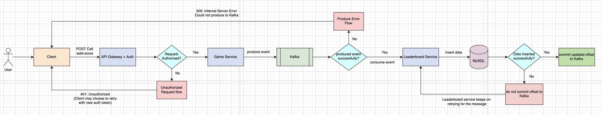
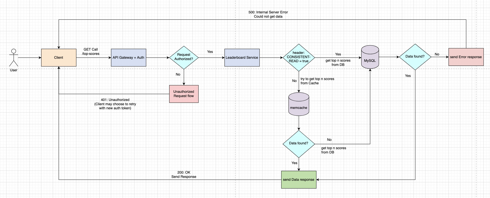
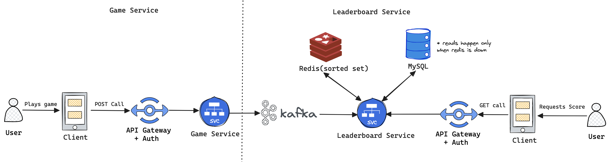
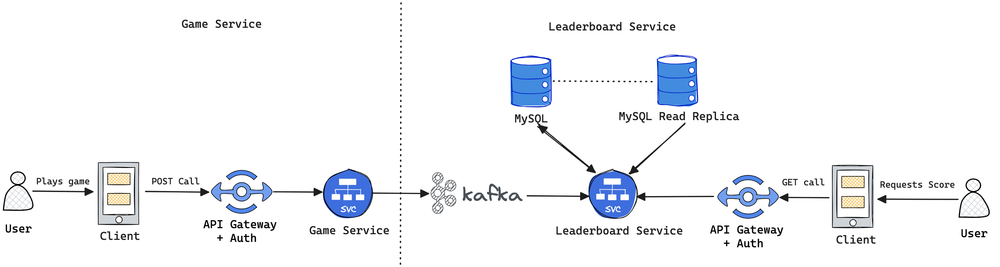
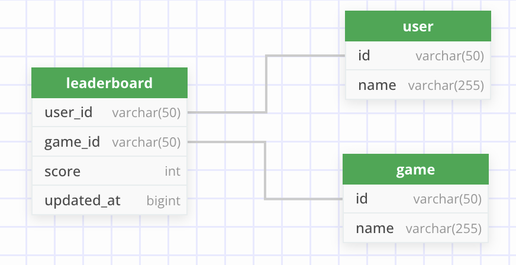

# leaderboard-service

## Overview

Typescript microservice to act as a key component of our gaming platform. This service is responsible for tracking and displaying the all-time top scores achieved by players in our games. 

As players complete games, the game service publishes their scores to a designated topic. The Leaderboard Service provides an API to retrieve the top n scores and the names of the players who attained those scores.

### Table of contents:

- [Detailed Approach](#detailed-approach)
  - [Flow Diagrams](#flow-diagrams)
- [Alternate Approaches](#alternate-approaches)
  - [Redis Sorted Set](#alternate-approach-1-redis-sorted-set)
  - [DB Read Replica](#alternate-approach-2-db-read-replica)
  - [Pod Local Cache](#alternate-approach-3-pod-local-cache)
- [API Contracts](#api-contracts)
- [DB Schema](#db-schema)
- [Local Development](#local-development)
  - [Testing](#testing)
  - [PR Guidelines](#pr-guidelines)


## Detailed Approach



`Leaderboard-Service` consumes events from `Kafka` and stores the data in `MySQL`. It also maintains a cache(`Memcached`)
to serve the traffic. We have a `cache-aside` arrangement here, which means that we will first check the cache for the data
and if it is not present in the cache, then we will fetch it from the DB and store it in the cache for future use.


| Dimension       | Salient Points                                                                     |
|-----------------|------------------------------------------------------------------------------------|
| Cost            | + Cheap at scale                                                                   |
| Complexity      | ~ Low/Medium complexity setting up a `cache-aside` arrangement                     |
| Scalability     | + Highly scalable and can serve huge amounts of reads at low latency               |
| User Experience | ~ User might get stale data, but  `lastUpdatedAt` can be used to provide better UX |

### Flow Diagrams

#### Add/Update score



#### Retrieve Top n Scorers



## Alternate Approaches

### Alternate Approach 1 (Redis Sorted Set)



Here we are using `Sorted Sets` in Redis to store the scores. A Redis sorted set is a collection of unique strings 
(members) ordered by an associated score. We can use this property to maintain the top scores for a game, and it will be 
automatically ordered. On every write we will also update the entry for the user in MySQL DB as well which will act as a backup
and serve traffic when redis is down. MySQL here also works as a persistent store for the scores data. We require this as by
default Redis does not support persistence, though we enable persistence and HA in Redis and remove MySQL as a backup.


| Dimension       | Salient Points                                                                                                                                                                             |
|-----------------|--------------------------------------------------------------------------------------------------------------------------------------------------------------------------------------------|
| Cost            | ~ Costs higher than Memcache, local-pod-cache<br/> ~ Costs ~= using DB read replicas                                                                                                       |
| Complexity      | ~ While low dev complexity, using a complex data-structure like `Sorted Sets` leads to a more complex solution<br/> - Vendor/Technology lock-in as using redis proprietary Data Structures |
| Scalability     | + Redis is highly scalable  and can serve huge amounts of reads at low latency                                                                                                             |
| User Experience | + User is always served the latest data                                                                                                                                                    |


### Alternate Approach 2 (DB Read Replica)



This option stores data just in MySQL and uses a read replica to help scale up reads.


| Dimension       | Salient Points                                                                                                                        |
|-----------------|---------------------------------------------------------------------------------------------------------------------------------------|
| Cost            | ~ While not the cheapest, costs should not be as high as using distributed SQL DBs<br/> ~ Costs higher than using a DB+Cache          |
| Complexity      | + Low Complexity as DB replication is handled at the DB layer                                                                         |
| Scalability     | ~ Quite scalable but might need to add a lot of replicas at higher scale<br/> ~ Latency will be higher than using a DB+Cache solution |
| User Experience | ~ User can be served stale date depending on replication lag                                                                          |

### Alternate Approach 3 (Pod Local Cache)


This approach is quite similar to the primary approach, but here we are using a local cache in each pod instead of memcached.


| Dimension       | Salient Points                                                                                                           |
|-----------------|--------------------------------------------------------------------------------------------------------------------------|
| Cost            | ++ Costs are minimal as we are using local pod memory as cache                                                           |
| Complexity      | + Low complexity implementing an in-memory cache<br/> + No additional system required for implementing caching           |
| Scalability     | + Quite scalable as we can scale pod memory horizontally/vertically                                                      |
| User Experience | -- Bad user experience as each pod can store a different value for top-scores, leading to an overall jittery experience  |

## API Contracts

### leaderboard-service/v1/public/top-scores

#### Request
```shell
curl --location 'localhost:3000/leaderboard-service/v1/public/top-scores?gameId=<GAME_ID_HERE>&limit=<LIMIT_HERE>' \
--header 'CONSISTENT-READ: false'
```
#### Response

_**Sample Response**_

Status Code :- 200 (OK)
```json
{
  "gameId":"6ba7b810-9dad-11d1-80b4-00c04fd430c8",
  "gameName":"car-racing",
  "topScorers":
  [
    {
      "score":200,
      "userId":"14192",
      "userName":"user14192"
    },
    {
      "score":200,
      "userId":"14195",
      "userName":"user14195"
    },
    {
      "score":120,
      "userId":"14191",
      "userName":"user14191"
    },
    {
      "score":100,
      "userId":"14193",
      "userName":"user14193"
    },
    {
      "score":100,
      "userId":"14194",
      "userName":"user14194"
    }
  ],
  "lastUpdatedAt":1698390071726
}
```

Status Code - 4xx/5xx

```json
{
  "errorMsg": "errString"
}
```

## DB Schema




### Data Definition
```sql
-- Create Database for service
CREATE DATABASE leaderboard_service;
USE leaderboard_service;

-- Create Tables
CREATE TABLE game (
    id VARCHAR(50) NOT NULL,
    name VARCHAR(255) DEFAULT 'game',
    PRIMARY KEY (id)
);
CREATE TABLE user (
    id VARCHAR(50) NOT NULL,
    name VARCHAR(255) DEFAULT 'gameUser',
    PRIMARY KEY (id)
);
CREATE TABLE leaderboard (
    user_id VARCHAR(50) NOT NULL,
    game_id VARCHAR(50) NOT NULL,
    score INT DEFAULT NULL,
    updated_at BIGINT DEFAULT NULL,
    PRIMARY KEY (game_id, user_id),
    
    -- Add a composite secondary index for querying top n scores within a game
    INDEX idx_game_score_updated_at (game_id, score DESC, updated_at ASC),
    FOREIGN KEY (user_id) REFERENCES user(id),
    FOREIGN KEY (game_id) REFERENCES game(id)
);
```

### Queries

Get Top **_n(limit)_**  scores for given _**gameId**_ 
```sql
-- Note:- SQL is autogenerated by ORM

-- Get Game Data
SELECT `game`.`id`, `game`.`name` FROM `game` 
WHERE `game`.`id` = :gameId
LIMIT 1;

-- Get Top Scorers Data
SELECT `leaderboard`.`score` AS score,
        `user`.`id` AS userId,
        `user`.`name` AS userName 
FROM `leaderboard` `leaderboard` 
INNER JOIN `user` `user` 
ON `user`.`id` = `leaderboard`.`user_id` 
WHERE `leaderboard`.`game_id` = :gameId 
ORDER BY `leaderboard`.`score` DESC, `leaderboard`.`updated_at` ASC LIMIT :limit;
```

## Local Development

1. Clone the repo and change directory to leaderboard-service
2. Run `nvm use` in terminal to use node version specified in `.nvmrc`
3. Run `npm ci` in terminal to install dependencies
4. Run `npx tsc` in terminal to compile typescript to javascript. This will create a `build` folder in root directory.
5. Start Kafka, MySQL and Memcached from docker, by running `docker-compose up -d` inside `devEnv` folder
6. javascript file is `build/src/index.js`
7. Run `node build/src/index.js` in terminal to start the server
8. This will start the Node.js server at `localhost:3000`

Swagger : http://localhost:3000/api-docs

### Testing
Clone the repo and change directory to leaderboard-service.

Run `npm test` to run tests and check coverage. There should be no failing tests and coverage should be above 90%.

Coverage report is generated in `coverage` folder.

### PR Guidelines
1. Create feature branch from main and write all code in feature branch
2. Run `npm prettier` to format code
3. Run `npm run lint` to check for linting errors
4. Run `npm test` to run tests and check coverage. There should be no failing tests and coverage should be above 90%
5. Create PR for main using template
6. In case of conflicts do <b> not </b> resolve on GitHub, but do following <br>
   a. `git branch -D main` <br>
   b. `git pull origin main` <br>
   c. `git checkout main` <br>
   d. `git merge feature_branch_name` <br>
   e. resolve conflicts <br>
   f. `git push origin main` <br>
7. Merge branch into main.